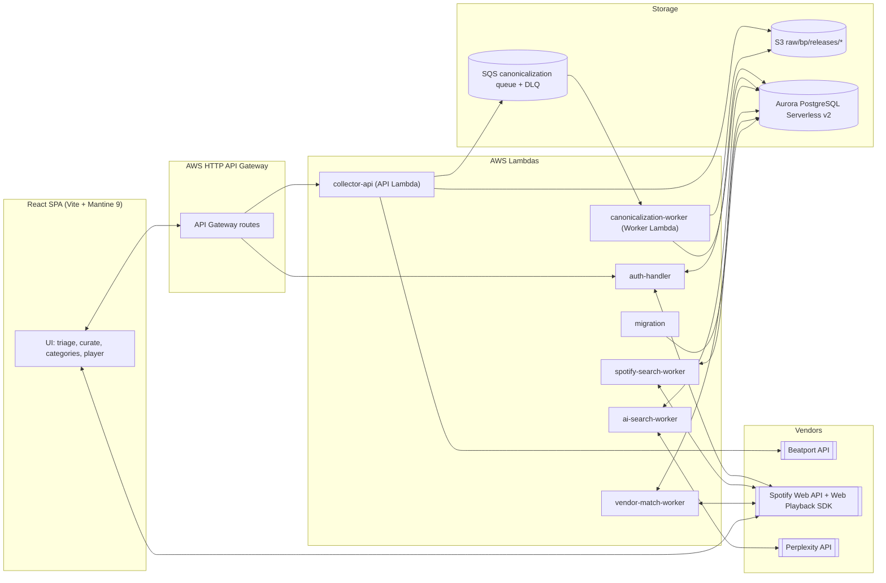

# CLOUDER Architecture

CLOUDER is a multi-tenant SaaS for DJs. A shared canonical music catalogue is fed by a serverless ingest pipeline; per-user overlays (playlists, tags, curation state) sit on top. The user-facing surface is a React SPA that talks to a single API Gateway endpoint.

## System overview

## Subsystems

- **Ingest.** API Lambda fetches a Beatport weekly snapshot, writes `releases.json.gz + meta.json` to S3, enqueues a canonicalization job, and records an `ingest_runs` row. See [`docs/data/raw-ingestion.md`](data/raw-ingestion.md).
- **Canonicalization.** SQS-triggered worker reads the raw snapshot, normalises tracks / artists / albums / labels, and upserts canonical entities into Aurora via the RDS Data API. See [`docs/data/canonicalization.md`](data/canonicalization.md).
- **Search and enrichment.** Per-track ISRC lookup against Spotify, plus a metadata-fallback path for misses. Perplexity is used to flag AI-suspected labels and artists. Results are cached in vendor-match tables. See [`docs/data/search-and-enrichment.md`](data/search-and-enrichment.md).
- **Curation.** The SPA's tap-to-assign UX assigns tracks from triage buckets into per-user playlists. Optimistic shrink keeps the cursor stable. See [`docs/frontend/features.md`](frontend/features.md) and ADR-0010, ADR-0012.
- **Playback.** Spotify Web Playback SDK is lazy-loaded on the first play. The CLOUDER auth refresh stream bundles a Spotify access token; the SPA keeps it in memory only. See [`docs/frontend/playback.md`](frontend/playback.md) and ADR-0011, ADR-0013.
- **Operations.** Aurora Serverless v2 with `min_acu=0` (auto-pause). Migrations run via a dedicated Lambda. See [`docs/ops/aurora.md`](ops/aurora.md) and [`docs/ops/deploy.md`](ops/deploy.md).

## Where to read next

- New backend contributor → [`docs/backend/README.md`](backend/README.md).
- New data engineer → [`docs/data/README.md`](data/README.md).
- New frontend contributor → [`docs/frontend/README.md`](frontend/README.md).
- Ops / on-call → [`docs/ops/runbook.md`](ops/runbook.md).
- Why-this-way questions → [`docs/adr/README.md`](adr/README.md).
