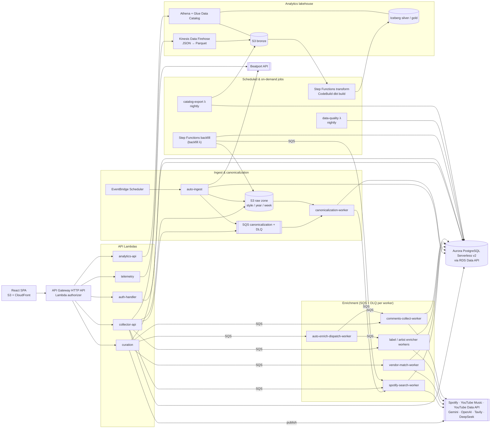

# CLOUDER Architecture

CLOUDER is a multi-tenant SaaS for DJs. A shared canonical music catalogue is fed by a serverless ingest pipeline; per-user overlays (playlists, tags, curation state) sit on top. The user-facing surface is a React SPA that talks to a single API Gateway endpoint. Everything below is defined in Terraform (`infra/`) and deployed by GitHub Actions on every merge to `main`.

## System overview

```mermaid
flowchart LR
    SPA["React SPA<br/>S3 + CloudFront"] --> APIGW["API Gateway HTTP API<br/>Lambda authorizer"]

    subgraph API["API Lambdas"]
        CAPI["collector-api"]
        CUR["curation"]
        AUTH["auth-handler"]
        AAPI["analytics-api"]
        TEL["telemetry"]
    end

    subgraph Ingest["Ingest & canonicalization"]
        SCHED["EventBridge Scheduler"] --> AI["auto-ingest"]
        RAW[("S3 raw zone<br/>style / year / week")]
        Q1[["SQS canonicalization + DLQ"]]
        CAN["canonicalization-worker"]
    end

    subgraph Enrich["Enrichment (SQS + DLQ per worker)"]
        SPW["spotify-search-worker"]
        VMW["vendor-match-worker"]
        LEN["label / artist enricher workers"]
        DSP["auto-enrich-dispatch-worker"]
        CMT["comments-collect-worker"]
    end

    subgraph Batch["Scheduled & on-demand jobs"]
        BF["Step Functions backfill<br/>(backfill λ)"]
        DQ["data-quality λ<br/>nightly"]
        EXP["catalog-export λ<br/>nightly"]
        DBT["Step Functions transform<br/>CodeBuild dbt build"]
    end

    subgraph Lake["Analytics lakehouse"]
        FH["Kinesis Data Firehose<br/>JSON → Parquet"]
        BRZ[("S3 bronze")]
        SIL[("Iceberg silver / gold")]
        ATH["Athena + Glue Data Catalog"]
    end

    DB[("Aurora PostgreSQL Serverless v2<br/>via RDS Data API")]
    BP[["Beatport API"]]
    VENDORS[["Spotify · YouTube Music · YouTube Data API<br/>Gemini · OpenAI · Tavily · DeepSeek"]]

    APIGW --> CAPI & CUR & AUTH & AAPI & TEL
    CAPI & AI --> BP
    CAPI & AI --> RAW
    CAPI & AI --> Q1
    CAPI & AI --> DB
    Q1 --> CAN
    RAW --> CAN
    CAN --> DB
    CAN -->|SQS| SPW
    CAPI & BF -->|SQS| SPW
    CAPI -->|SQS| LEN
    CUR -->|SQS| VMW & DSP & CMT
    CUR -->|publish| VENDORS
    DSP -->|SQS| LEN & CMT
    SPW & VMW & LEN & CMT --> VENDORS
    SPW & VMW & LEN & CMT --> DB
    CUR & AUTH --> DB
    BF --> RAW
    BF --> DB
    DQ --> DB
    EXP --> DB
    EXP --> BRZ
    TEL --> FH --> BRZ
    BRZ --> DBT --> SIL
    AAPI --> ATH
    ATH --- BRZ & SIL
```

Every CloudWatch alarm notifies one SNS topic with an email subscription.

## Lambda functions

All functions share one Python package (`src/collector/`); each has its own entry module. AWS names carry the `clouder-prod-` prefix.

| Function | Entry module | Trigger | Purpose |
|---|---|---|---|
| `collector-api` | `collector.handler` | API Gateway | Admin ingest, catalog reads, the curation funnel (from Aurora), admin endpoints (coverage, enrichment, auto-ingest settings) |
| `curation` | `collector.curation_handler` | API Gateway | Triage, categories, playlists, tags, publishing to Spotify / YouTube Music |
| `auth-handler` | `collector.auth_handler` | API Gateway | Spotify OAuth (PKCE) login, callback, refresh-token rotation |
| `auth-authorizer` | `collector.auth_authorizer` | API Gateway authorizer | Validates the CLOUDER JWT on every protected route |
| `analytics-api` | `collector.analytics_handler` | API Gateway | Listening and time-per-track analytics from Athena |
| `telemetry` | `collector.telemetry_handler` | API Gateway | Validates SPA telemetry batches and forwards them to Firehose |
| `auto-ingest` | `collector.auto_ingest_handler` | EventBridge Scheduler | Plans daily runs; logs in to Beatport and ingests due and backfill weeks |
| `canonicalization-worker` | `collector.worker_handler` | SQS | Contract screening, normalization, canonical upserts |
| `spotify-search-worker` | `collector.spotify_handler` | SQS | ISRC lookup + metadata fallback against Spotify |
| `vendor-match-worker` | `collector.vendor_match_handler` | SQS | YouTube Music matching with fuzzy scoring and a review queue |
| `label-enricher-worker` | `collector.label_enrichment_handler` | SQS | Multi-vendor LLM research on labels |
| `artist-enricher-worker` | `collector.artist_enrichment_handler` | SQS | Multi-vendor LLM research on artists |
| `auto-enrich-dispatch-worker` | `collector.auto_enrich_dispatch_handler` | SQS | Fans out label, artist and comment enrichment for a finalized triage block |
| `comments-collect-worker` | `collector.comments_collect_handler` | SQS | Collects YouTube comments for one video per message |
| `backfill` | `collector.backfill_handler` | Step Functions | Plans and replays stored raw runs (dry run or apply) |
| `data-quality` | `collector.data_quality_handler` | EventBridge (00:10 UTC) | Eleven read-only SQL checks → CloudWatch metrics |
| `catalog-export` | `collector.catalog_export_handler` | EventBridge (00:00 UTC) | Nightly catalog snapshot into the lake (`bronze/catalog_export/`) |
| `db-migration` | `collector.migration_handler` | Deploy workflow | Runs Alembic migrations before the API code ships |

## Subsystems

- **Ingest.** The API Lambda (admin, on demand) and the auto-ingest Lambda (scheduled) fetch a Beatport style × Saturday-week, write `releases.json.gz + meta.json` to S3, record an `ingest_runs` row and enqueue canonicalization. Auto-ingest logs in per run and ingests the due week of every visible style first, then backfills evenly. See [`docs/data/raw-ingestion.md`](data/raw-ingestion.md) and [`docs/data/auto-ingest.md`](data/auto-ingest.md).
- **Canonicalization.** The SQS worker screens raw records against a data contract (bad records go to quarantine, drift raises an alarm), normalizes tracks / artists / albums / labels and upserts them set-based through the RDS Data API. Writes are replay-safe, so stored raw runs can be replayed — previewed first as a dry run — by the backfill state machine. See [`docs/data/canonicalization.md`](data/canonicalization.md), [`docs/data/contracts.md`](data/contracts.md) and [`docs/ops/backfill.md`](ops/backfill.md).
- **Search and enrichment.** Spotify ISRC lookup with a metadata fallback, YouTube Music matching with a human review queue, and multi-vendor LLM research on labels and artists (Gemini, OpenAI, Tavily + DeepSeek). See [`docs/data/search-and-enrichment.md`](data/search-and-enrichment.md), [`docs/data/entity-resolution.md`](data/entity-resolution.md), ADR-0016 and ADR-0017.
- **Curation.** The SPA's tap-to-assign UX moves tracks from triage buckets into per-user categories and playlists. Optimistic shrink keeps the cursor stable. See [`docs/frontend/features.md`](frontend/features.md) and ADR-0010, ADR-0012.
- **Playback.** Spotify Web Playback SDK is lazy-loaded on the first play. The CLOUDER auth refresh stream bundles a Spotify access token; the SPA keeps it in memory only. See [`docs/frontend/playback.md`](frontend/playback.md) and ADR-0011, ADR-0013.
- **Analytics lakehouse.** Telemetry lands in bronze through Firehose; a nightly dbt build on Athena turns it and the catalog snapshots into Iceberg silver/gold (deduplicated events, SCD2 track history, plays). The Home cards read silver history plus the live bronze tail. See [`docs/data/lakehouse.md`](data/lakehouse.md).
- **Data quality.** A nightly Lambda runs eleven SQL checks (freshness, volume, completeness, integrity, plausibility) with SLOs. See [`docs/data/data-quality.md`](data/data-quality.md) and ADR-0023.
- **Alerting.** CloudWatch alarms (errors on every Lambda, API latency, DLQ depth, Firehose delivery, data quality, contract drift, failed dbt build, failed auto-ingest run) notify one SNS topic with an email subscription. See [`docs/ops/deploy.md`](ops/deploy.md).
- **Access control.** Every Lambda runs under its own least-privilege role (`infra/lambda_roles.tf`); the API stage is rate-limited and writes JSON access logs.
- **Operations.** Aurora Serverless v2 with `min_acu=0` (auto-pause). Migrations run via a dedicated Lambda before the API code is updated. See [`docs/ops/aurora.md`](ops/aurora.md) and [`docs/ops/deploy.md`](ops/deploy.md).

## Where to read next

- New backend contributor → [`docs/backend/README.md`](backend/README.md).
- New data engineer → [`docs/data/README.md`](data/README.md).
- New frontend contributor → [`docs/frontend/README.md`](frontend/README.md).
- Ops / on-call → [`docs/ops/runbook.md`](ops/runbook.md).
- Why-this-way questions → [`docs/adr/README.md`](adr/README.md).
- Where to look in the code → [`docs/engineering-highlights.md`](engineering-highlights.md).
- What breaks at 10× / 100× → [`docs/scalability.md`](scalability.md).
