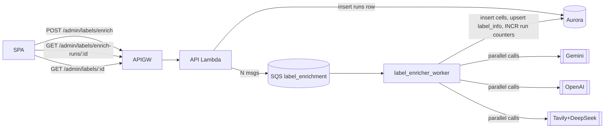

# Label Enrichment Backend — Design Spec

**Date:** 2026-05-18
**Status:** approved-pending-review
**Scope:** Backend + infra only. Frontend label page deferred.

## Motivation

The existing label-search subsystem (Perplexity-only, single prompt `label_info v1`, auto-fired during ingest) ships fragile signals and clogs the canonical schema. The label-AI sandbox at `experiments/labels/` has produced a working multi-vendor pipeline (Gemini, OpenAI, Tavily+DeepSeek) with a consensus aggregator and a richer `LabelInfo` schema (tagline, status, primary_styles, social URLs). We now port that pipeline into the production app so the resulting label profile is persisted in Aurora and ready for a future SPA "label page."

The old subsystem is removed wholesale; the new one is explicitly triggered, multi-vendor, and stores its own provenance.

## Out of scope (Phase 2+)

- Frontend label page (will be a separate spec).
- Cron / scheduled re-enrichment.
- Re-run diff UI, cell GC, ai_signal indexing.
- Discovery of which labels to enrich — admin sends a curated list.

## Architecture

### Async via SQS

A single run with `N` labels × `M` vendors exceeds the API Gateway 29-second budget (Gemini alone averages ~58 s per call in the experiment). We follow the same pattern as Beatport ingest: API Lambda enqueues, worker Lambda processes.



**Granularity decision: per-label SQS message, not per-cell.** The aggregator needs every cell for a label in one place to run `merge_cells`. Splitting per-cell would require a separate "all cells done" trigger. Per-label messages stay within Lambda's 15-min budget (~60-90 s per label observed) and keep the orchestration simple.

### Concurrency

Worker uses `ThreadPoolExecutor` internally to call all vendors in parallel for one label (identical to the experiment's `runner.py`). SQS reserved concurrency on the worker Lambda caps cross-label parallelism. Default 10. Rate limits at the vendor side (OpenAI 500 RPM, Gemini 1000 RPM, Tavily 100 RPM paid) are well above 10 concurrent.

## Removal — code

The following files / symbols are deleted in this work. Production callers are migrated or also deleted.

| Path | Action |
|---|---|
| `src/collector/search/` (whole package) | delete |
| `src/collector/providers/perplexity/` (label, artist, `__init__`) | delete |
| `src/collector/search_handler.py` | delete |
| `src/collector/schemas.py`: `EntitySearchMessage`, `LabelSearchMessage`, `coerce_search_message`, `validation_error_message`-callers tied to search | delete the search-only bits |
| `src/collector/repositories.py`: `save_search_result`, `find_labels_needing_search`, `update_entity_is_ai_suspected`, `_AI_SUSPECTED_TABLES` mapping | delete |
| `src/collector/db_models.py`: `AISearchResult` ORM class | delete |
| `src/collector/providers/registry.py`: `_build_perplexity_label`, `_build_perplexity_artist`, `get_enricher_for_prompt`, those entries in `_BUILDERS` | delete |
| `src/collector/settings.py`: `SearchWorkerSettings`, `get_search_worker_settings`, cache-clear entry | delete |
| `src/collector/handler.py`: `_enqueue_label_search`, `from .search.prompts import get_latest as get_latest_prompt`, `search_label_count` field of `AdminIngestRequestIn`, `search_labels_enqueued` in response | delete |
| Tests for any of the above | delete |

### What we keep

- The `is_ai_suspected` boolean column on `clouder_labels`, `clouder_artists`, `clouder_tracks`. The triage UI reads this; we re-populate it from the new pipeline as a denormalized projection (see "Projection" below).
- Migration `20260420_09_release_type_and_ai_flag.py` stays (it created `is_ai_suspected`).
- The `ProcessingReason` / `ProcessingOutcome` machinery — unrelated to search.

## Removal — infra

| Resource | Action |
|---|---|
| `aws_lambda_function.ai_search_worker` + log group | delete |
| `aws_lambda_event_source_mapping.ai_search_queue` | delete |
| `aws_sqs_queue.ai_search`, `aws_sqs_queue.ai_search_dlq` | delete |
| `aws_cloudwatch_metric_alarm.ai_search_throttles` and any DLQ alarms scoped to it | delete |
| IAM stmts referencing `aws_sqs_queue.ai_search.arn`, `aws_cloudwatch_log_group.ai_search_worker.arn` | delete |
| Variables: `ai_search_enabled`, `ai_search_worker_lambda_*`, `ai_search_batch_size`, `ai_search_worker_reserved_concurrency`, `ai_search_queue_*`, `perplexity_api_key_secret_arn`, `perplexity_api_key_ssm_parameter` | delete |
| Locals: `ai_search_worker_lambda_name`, `ai_search_queue_name`, `ai_search_dlq_name` | delete |
| Outputs: `ai_search_worker_lambda_function_name` | delete |
| Env vars on API Lambda: `AI_SEARCH_ENABLED`, `AI_SEARCH_QUEUE_URL` | delete |

## Removal — DB

A new Alembic migration drops `ai_search_results` (table + unique index `uq_search_result`). No data preservation: the rows came from a discontinued pipeline.

## New code — `src/collector/label_enrichment/`

```
src/collector/label_enrichment/
├── __init__.py
├── schemas.py          # LabelInfo, AISignal, enums — ported from experiments
├── prompts/
│   ├── __init__.py     # registry: register/get/load_builtin
│   ├── base.py         # PromptConfig dataclass
│   ├── label_v2_facts.py
│   └── label_v3_app_fields.py
├── vendors/
│   ├── __init__.py
│   ├── base.py         # VendorAdapter Protocol, VendorResponse dataclass
│   ├── gemini.py
│   ├── openai.py
│   ├── tavily_deepseek.py
│   └── pricing.py
├── aggregator.py       # merge_cells(cells, deepseek_client, label_name) → MergedLabelInfo
├── orchestrator.py     # enrich_label_for_run() — high-level wiring
└── repository.py       # Aurora Data API persistence
```

**Ground rule:** No runtime `psycopg`. All DB access goes through the existing Data API layer in `src/collector/data_api.py`.

### `LabelInfo` schema

Ported verbatim from `experiments/labels/src/lab/schemas.py`. 21 fields across identity / size / channels / taxonomy / AI / meta. Pydantic v2.

### Vendor adapter contract

Same Protocol as the experiment. Adapters must never raise: failures return a `VendorResponse(parsed=None, error=...)`. The orchestrator decides per-cell ok/error.

### Aggregator

`merge_cells(cells: list[Cell], deepseek_client, label_name) → MergedLabelInfo`

- Deterministic merge for numeric (median, int-cast), enum (majority, treat `unknown` as abstention), URL (highest-confidence non-null), list (union with round-robin ranking for `notable_artists`, `primary_styles`).
- Single DeepSeek call for narrative fields: `tagline`, `summary`, `ai_reasoning`, `notes`. Max-confidence fallback on failure.
- Provenance string per field: `median:X`, `majority(N/M definitive)`, `only definitive source(vendor)`, `tie → highest confidence(value)`, `union top-5 round-robin(N unique, M shared)`.

### Orchestrator

```python
def enrich_label_for_run(
    *,
    run_id: str,
    label_id: str,
    label_name: str,
    style: str,
    release_name: str | None,
    vendors: list[VendorAdapter],
    merge_client,                # OpenAI-compatible DeepSeek client
    merge_model: str,
    prompt: PromptConfig,
    repository: LabelEnrichmentRepository,
) -> None:
    cells = run_vendors_parallel(vendors, label_name, style, release_name, prompt)
    for cell in cells:
        repository.insert_cell(run_id, label_id, cell)
    merged = merge_cells(cells, merge_client, merge_model, label_name)
    repository.upsert_label_info(label_id, run_id, prompt, merged)
    repository.project_ai_suspected(label_id, merged)
    repository.increment_run_counters(run_id, cells, completed=True)
```

### Repository

Aurora Data API calls. Methods:

- `create_run(spec) → run_id` — inserts into `clouder_label_enrichment_runs` with `status='queued'`, computes `cells_total = len(labels) * len(vendors)`.
- `mark_run_running(run_id)` — first time a worker picks up a cell, flips status to `running` and stamps `started_at`.
- `insert_cell(run_id, label_id, cell)` — write-once row in `clouder_label_enrichment_cells`.
- `upsert_label_info(label_id, run_id, prompt, merged)` — `INSERT ... ON CONFLICT (label_id) DO UPDATE SET ...`.
- `project_ai_suspected(label_id, merged)` — sets `clouder_labels.is_ai_suspected = TRUE` iff `merged.ai_content in (suspected, confirmed) AND merged.confidence >= 0.5`; sets `FALSE` if `none_detected AND confidence >= 0.5`; no-op otherwise. Threshold via env var `AI_FLAG_CONFIDENCE_THRESHOLD`, default `0.5`.
- `increment_run_counters(run_id, cells, completed)` — atomic `UPDATE clouder_label_enrichment_runs SET cells_ok = cells_ok + :ok, cells_error = cells_error + :err, cost_usd = cost_usd + :cost, status = CASE WHEN cells_ok + cells_error + :ok + :err >= cells_total THEN 'completed' ELSE 'running' END WHERE id = :run_id`.
- `get_run(run_id)`, `get_label_info(label_id)`, `upsert_label_by_name(name) → label_id`.

## New code — handler integration

A single new SQS-driven Lambda handler at `src/collector/label_enrichment_handler.py` plus three new HTTP routes added to `src/collector/handler.py`.

### `POST /admin/labels/enrich`

Body (Pydantic `EnrichLabelsRequestIn`):

```python
class EnrichLabelInput(BaseModel):
    label_name: str
    style: str
    release_name: str | None = None

class EnrichLabelsRequestIn(BaseModel):
    labels: list[EnrichLabelInput]            # 1..100
    vendors: list[Literal["gemini","openai","tavily_deepseek"]]
    models: dict[str, str]                    # keyed by vendor name
    prompt_slug: str                          # "label_v3_app_fields"
    prompt_version: str                       # "v1"
    merge_vendor: Literal["deepseek"]         # Phase 1 — only DeepSeek narrative merge wired
    merge_model: str                          # e.g. "deepseek-v4-flash"
```

Flow:
1. `_require_admin(event)`.
2. Validate (label list 1..100, vendor list non-empty subset of allowed, each vendor has a model in `models`).
3. Per label, upsert into `clouder_labels` by `normalized_name` → `label_id`.
4. `repository.create_run(spec)` → `run_id`.
5. For each label, send SQS message:
   ```json
   {
     "run_id": "...",
     "label_id": "...",
     "label_name": "...",
     "style": "...",
     "release_name": null
   }
   ```
6. Return `202 {"run_id","queued_labels": N}`.

Note: vendors/models/prompt/merge config live on the run row, not in the message. Worker reads the run row at start to know how to dispatch.

### `GET /admin/labels/enrich-runs/{run_id}`

Returns the run row. Admin scope.

### `GET /admin/labels/{label_id}`

Returns the merged label_info row (joined with `clouder_labels.name`). Admin scope for now (frontend feature later may relax).

### Worker — `src/collector/label_enrichment_handler.py`

`lambda_handler(event, context)` shape mirrors `worker_handler.py`:

- Validate SQS record → `LabelEnrichmentMessage` Pydantic model.
- Load run config (vendors, models, prompt, merge model) via `repository.get_run(run_id)`.
- `mark_run_running(run_id)` (idempotent — only flips queued→running once).
- Build vendor adapters from run config + Secrets Manager keys.
- Call orchestrator. Exceptions inside orchestrator are isolated per cell (never-raise adapters); only catastrophic errors (DB connectivity, secret-fetch) re-raise and the SQS message goes back to the queue for retry.
- After all cells written + label_info upserted, call `increment_run_counters` once with the bulk delta — atomic single statement.

## Data model — DDL summary

```sql
CREATE TABLE clouder_label_enrichment_runs (
  id varchar(36) PRIMARY KEY,
  status text NOT NULL DEFAULT 'queued',
  prompt_slug text NOT NULL,
  prompt_version text NOT NULL,
  vendors jsonb NOT NULL,
  models jsonb NOT NULL,
  merge_vendor text NOT NULL,
  merge_model text NOT NULL,
  requested_labels int NOT NULL,
  cells_total int NOT NULL,
  cells_ok int NOT NULL DEFAULT 0,
  cells_error int NOT NULL DEFAULT 0,
  cost_usd numeric(10,4) NOT NULL DEFAULT 0,
  created_by_user_id varchar(36),
  created_at timestamptz NOT NULL,
  started_at timestamptz,
  finished_at timestamptz
);
CREATE INDEX idx_label_enr_runs_created_at
  ON clouder_label_enrichment_runs (created_at DESC);

CREATE TABLE clouder_label_enrichment_cells (
  id varchar(36) PRIMARY KEY,
  run_id varchar(36) NOT NULL REFERENCES clouder_label_enrichment_runs(id),
  label_id varchar(36) NOT NULL REFERENCES clouder_labels(id),
  vendor text NOT NULL,
  model text NOT NULL,
  status text NOT NULL,
  parsed jsonb,
  citations jsonb NOT NULL DEFAULT '[]'::jsonb,
  usage jsonb NOT NULL DEFAULT '{}'::jsonb,
  latency_ms int,
  error jsonb,
  created_at timestamptz NOT NULL,
  UNIQUE (run_id, label_id, vendor)
);
CREATE INDEX idx_label_enr_cells_label
  ON clouder_label_enrichment_cells (label_id, created_at DESC);

CREATE TABLE clouder_label_info (
  label_id varchar(36) PRIMARY KEY REFERENCES clouder_labels(id),
  last_run_id varchar(36) NOT NULL REFERENCES clouder_label_enrichment_runs(id),
  prompt_slug text NOT NULL,           -- lineage; full text lives in git
  prompt_version text NOT NULL,        -- lineage; full text lives in git
  merged jsonb NOT NULL,               -- full LabelInfo, same schema as cell.parsed
  provenance jsonb NOT NULL,           -- { <field_name>: { "value": <merged_value>, "source": "<provenance_string>" } }
  -- Denormalized scalars for hot filter / sort paths (mirrored from merged):
  ai_content text NOT NULL,
  ai_confidence numeric(3,2) NOT NULL,
  status text NOT NULL,                -- active | inactive | unknown
  primary_styles text[] NOT NULL DEFAULT '{}',
  tagline text,
  country text,
  founded_year int,
  activity text,                       -- fire_hose | steady | low | dormant | unknown
  last_release_date date,
  updated_at timestamptz NOT NULL
);
CREATE INDEX idx_label_info_updated_at
  ON clouder_label_info (updated_at DESC);
CREATE INDEX idx_label_info_status
  ON clouder_label_info (status);
CREATE INDEX idx_label_info_primary_styles
  ON clouder_label_info USING GIN (primary_styles);
```

### Why hybrid (JSONB + denormalized scalars)

`LabelInfo` has 21 fields and is expected to grow as the frontend exposes more (more social networks, additional vendor signals, future fields). Storing every field as its own column means a migration per addition — every "let's add Mixcloud URL" turns into an Alembic change + Data API SQL change + handler change. The single `merged jsonb` blob absorbs schema evolution without DB churn.

Hybrid keeps both: the JSONB is the source of truth, and the columns mirrored from it (`ai_content`, `status`, `primary_styles`, `country`, `founded_year`, `activity`, `last_release_date`, `tagline`) are the fields the frontend will sort / filter / paginate by. Querying GIN on JSONB works but is slower and harder to read than a B-tree on a typed column. We pay one upsert-time copy for every read-time benefit.

**Rule of thumb for what to denormalize**: a field is mirrored to a column only if a list / browse / filter UI is likely to need it. Narrative fields (`summary`, `tagline`, `ai_reasoning`, `notes`) and channel URLs stay JSONB-only.

### Where prompts live

Prompts live in code, not in the database. `src/collector/label_enrichment/prompts/label_v3_app_fields.py` defines a `PromptConfig` and self-registers into a process-wide registry at Lambda cold-start (same pattern as the experiment).

The run row and label_info row carry only `(prompt_slug, prompt_version)` as a lineage tag. The full system + user template is always recoverable from git by checking out the commit that introduced `prompt_version`. Updating a prompt = new version = bump `prompt_version` to `v2` and register both side-by-side until the old version is retired.

**Why not in DB?**
- Versioning in git is stricter than a `prompts` table: diff review, blame, PR gates.
- A Lambda cold-start doesn't need a DB round-trip just to load a template.
- Re-running with a historical prompt is a deploy-by-tag, not a row-fetch — appropriate for a low-frequency operation.

**Phase 2 option** (not in this scope): snapshot the rendered system + user prompts into `cells.rendered_system_prompt` / `cells.rendered_user_prompt` for forensic debugging. Adds ~5-20 KB per cell. Skip until a "why did Gemini answer X" question actually demands it.

Two Alembic migrations:
1. **drop**: `ai_search_results` table + `uq_search_result` index.
2. **add**: the three tables above.

## Settings / secrets

A new `LabelEnrichmentWorkerSettings` in `settings.py`:

```python
class LabelEnrichmentWorkerSettings(BaseSettings):
    gemini_api_key: str
    openai_api_key: str
    tavily_api_key: str
    deepseek_api_key: str
    ai_flag_confidence_threshold: float = 0.5
    request_timeout_s: float = 120.0
```

Each key resolved via `_resolve_simple_secret(NAME_KEY, NAME_KEY_SECRET_ARN)` — same pattern as `PERPLEXITY_API_KEY` today.

API Lambda needs none of those secrets — only the SQS queue URL.

## Infra additions

```
infra/locals (main.tf):
  label_enrichment_worker_lambda_name = "${name_prefix}-label-enricher-worker"
  label_enrichment_queue_name         = "${name_prefix}-label-enrichment"
  label_enrichment_dlq_name           = "${name_prefix}-label-enrichment-dlq"

infra/lambda.tf:
  aws_lambda_function.label_enricher_worker
    handler = "collector.label_enrichment_handler.lambda_handler"
    timeout = 900 (15 min)
    memory  = 1024 MB
    reserved_concurrent_executions = var.label_enrichment_worker_reserved_concurrency  (default 10)
    env: GEMINI_API_KEY_*, OPENAI_API_KEY_*, TAVILY_API_KEY_*, DEEPSEEK_API_KEY_*,
         LABEL_ENRICHMENT_QUEUE_URL, AI_FLAG_CONFIDENCE_THRESHOLD,
         AURORA_* (same as other workers)
  aws_lambda_event_source_mapping.label_enrichment_queue
    batch_size = 1   # one label per invocation; ThreadPool inside

infra/sqs.tf:
  aws_sqs_queue.label_enrichment + aws_sqs_queue.label_enrichment_dlq
    visibility_timeout = 1000s (worker timeout + 100s buffer)
    max_receive_count = 3

infra/iam.tf:
  worker policy: SQS receive on label_enrichment, Aurora Data API access,
                 Secrets Manager Get on the 4 new ARNs, logs.
  API Lambda policy: add SendMessage on label_enrichment queue.

infra/alarms.tf:
  - label_enricher throttles alarm (mirrors ai_search_throttles)
  - label_enrichment_dlq depth > 0 alarm
  - Add label_enricher_worker to the shared lambda-errors composite alarm.

infra/variables.tf:
  + gemini_api_key_secret_arn, openai_api_key_secret_arn,
    tavily_api_key_secret_arn, deepseek_api_key_secret_arn
  + label_enrichment_worker_lambda_timeout_seconds (default 900)
  + label_enrichment_worker_lambda_memory_mb        (default 1024)
  + label_enrichment_worker_reserved_concurrency    (default 10)
  + label_enrichment_queue_visibility_timeout_seconds (default 1000)
  + label_enrichment_queue_retention_seconds          (default 345600)
  + ai_flag_confidence_threshold                      (default 0.5)

infra/outputs.tf:
  + label_enricher_worker_lambda_function_name
  + label_enrichment_queue_url
```

API Gateway routes added to the existing HTTP API. Auth = JWT authorizer (existing); admin check is enforced inside the API Lambda via `_require_admin`.

## Packaging

`src/collector/requirements.txt` adds:
- `google-genai` (Gemini)
- `openai` (works for OpenAI + DeepSeek)
- `httpx` (Tavily Search API)

Removes `urllib`-style perplexity. The package size grows by roughly 40-50 MB unpacked, well within the 250 MB Lambda limit (current handler zip is ~30 MB). `scripts/package_lambda.sh` already builds a single ZIP per Lambda function; the new worker reuses that pipeline.

## OpenAPI

`docs/api/openapi.yaml` is generated. After adding the 3 new routes in `scripts/generate_openapi.py:ROUTES` and their request/response schemas, regenerate with `PYTHONPATH=src .venv/bin/python scripts/generate_openapi.py`. The CI step that diff-checks `frontend/src/api/schema.d.ts` will pass once both sides are regenerated.

## Testing strategy

### Unit (pytest under `tests/unit/`)
- `test_label_enrichment_schemas.py` — LabelInfo round-trip, enum validation.
- `test_label_enrichment_aggregator.py` — port the existing experiment tests for `merge_cells`. DeepSeek client is mocked.
- `test_label_enrichment_repository.py` — Data API SQL with `FakeDataApi` (existing test fixture). Covers `create_run`, `insert_cell`, `upsert_label_info`, `project_ai_suspected`, `increment_run_counters`.
- `test_label_enrichment_handler_api.py` — POST request validation, admin gate, SQS send, run creation.
- `test_label_enrichment_handler_worker.py` — SQS message → orchestrator (mocked vendors) → DB writes.

### Integration (`tests/integration/`)
- One end-to-end: real Aurora (via the existing integration harness), stub vendors, exercise POST → SQS → worker → DB state.

### Migration tests
- `test_migrations.py` upgrade head + downgrade one step → schema matches snapshot.

## Operational notes

- Cold-start: first request after Aurora idle (300 s) may 503 — same gotcha as documented in `docs/ops/runbook.md`. POST returns 202 immediately after enqueue, so the cold-start window is only the run-row insert + N SQS sends.
- Per-label cost (observed in experiments): ~$0.004. A 100-label run costs ~$0.40.
- Run row `status` transitions: `queued` → `running` (first worker pick-up) → `completed` (all cells written). The `CASE WHEN` flip lives inside a single `UPDATE`, so the cells_ok + cells_error == cells_total check is race-free across concurrent workers. If a worker dies mid-label (Lambda timeout, OOM) and the message DLQs, the run stays in `running` indefinitely — that's an operator-visible degraded state for Phase 1. Phase 2 may add a reconciler that flips long-`running` runs to `failed`.
- **Invariant the orchestrator must uphold:** for one label it inserts *exactly* `len(vendors)` cell rows (some `status='ok'`, some `status='error'`) before calling `increment_run_counters`. Never-raise vendor adapters make this trivial — any adapter exception produces an `error` cell. This is what guarantees `cells_ok + cells_error` eventually equals `cells_total` for a healthy run.
- Retries: SQS `max_receive_count=3` means an unlucky label gets retried; transient vendor errors are absorbed inside the never-raise adapters, so retries only fire on infra-level errors (DB, secrets) — and the cell-insert side is idempotent because of the `UNIQUE (run_id, label_id, vendor)` constraint (use `ON CONFLICT DO NOTHING`).
- **Counter non-idempotency under SQS retry.** If a worker invocation completes the orchestrator but the SQS message redrives (e.g. visibility-timeout overrun), the second invocation will (a) idempotently skip the cell inserts via `ON CONFLICT DO NOTHING`, (b) re-call `merge_cells`, (c) re-call `upsert_label_info` (idempotent — last-write-wins), and (d) call `increment_run_counters` again, inflating `cost_usd` and potentially prematurely flipping `status='completed'`. For Phase 1 with `batch_size=1` and retries restricted to infra-level errors, this is acceptable. Phase 2 may add: `insert_cell` returns `INSERT ... RETURNING` to count only newly-inserted rows, and counter deltas derive from that count rather than `len(adapters)`.

## Risks / open questions resolved

- **Why keep `is_ai_suspected` instead of dropping it?** Frontend triage UI reads it via `curation_handler.py` → `triage_repository.py` → `BucketTrackRow.tsx`. Dropping it forces a coupled frontend change outside this scope. We instead re-populate it from the new pipeline as a denormalized projection.
- **Why per-label SQS message, not per-cell + fan-in?** Fan-in needs a "last-cell wins" trigger that's hard to make exactly-once in SQS. Per-label keeps the aggregator stateless and the worker self-contained, at the cost of one Lambda invocation per label (acceptable: <100/run typical, 15-min Lambda budget).
- **Why upsert label by `normalized_name` instead of requiring `label_id` in the request?** Enrichment is most useful for labels that don't yet exist in the canonical catalog (new / AI-only labels). Upsert removes a coupling to the Beatport ingest path.

## Implementation phasing

This spec is one cohesive subsystem and should produce one plan. Suggested task order in the plan:

1. Schema + migration (drop old, add new tables).
2. Port LabelInfo / prompts / vendors / aggregator into `src/collector/label_enrichment/`.
3. Repository on Data API.
4. Orchestrator.
5. API Lambda routes + Pydantic request schemas.
6. Worker Lambda handler.
7. Remove old code (search_handler, providers/perplexity, search/, settings entries, schemas entries, _enqueue_label_search, AISearchResult ORM, etc.).
8. Terraform: remove old, add new.
9. Regenerate OpenAPI.
10. Tests at each step.

Step 7 is done after step 6 (so the new pipeline compiles before the old one disappears).
