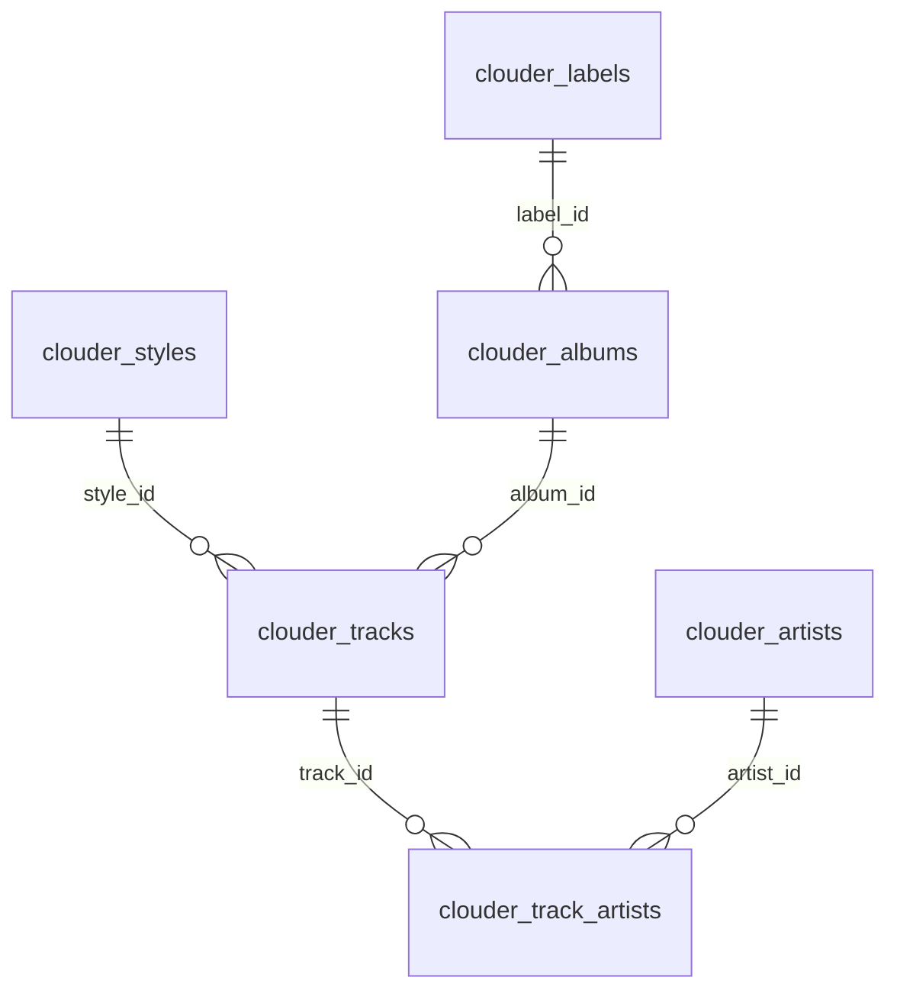
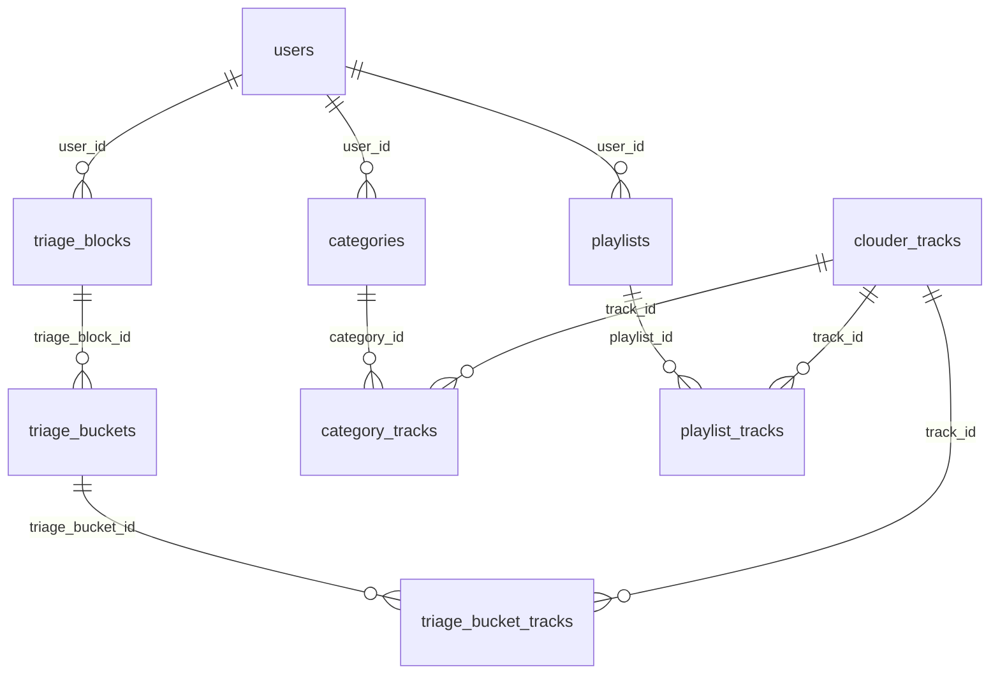

# Data model

Aurora PostgreSQL 16, database `clouder`. All PKs are UUID (String(36)). Timestamps are `TIMESTAMPTZ`.

Source: `src/collector/db_models.py`.

---

## Domain map

```
External sources (Beatport, Spotify)
        |
        v
   Source layer          raw representation
   ─────────────         before canonicalization
   ingest_runs
   source_entities
   source_relations
        |
        | identity_map  (source × entity_type × external_id) → clouder_id
        v
   Canonical layer       de-duplicated, vendor-neutral
   ─────────────
   clouder_labels
   clouder_styles
   clouder_artists
   clouder_albums
   clouder_tracks
   clouder_track_artists
        |
        v
   Enrichment            per-entity AI results; vendor match cache
   ─────────────
   ai_search_results
   vendor_track_map
   match_review_queue
        |
        v
   Triage / Curation     per-user overlays (ADR-0002)
   ─────────────
   triage_blocks / triage_buckets / triage_bucket_tracks
   categories / category_tracks
   playlists / playlist_tracks
   user_tags / track_tags
```

---

## Source layer

### ingest_runs

One row per Beatport API pull.

| Column | Type | Notes |
|---|---|---|
| run_id | String(36) PK | UUID |
| source | String(32) | `beatport` |
| style_id | Integer | Beatport genre ID |
| iso_year / iso_week | Integer nullable | Legacy ISO-week path |
| week_year / week_number | Integer nullable | Saturday-week path (ADR-0003) |
| period_start / period_end | Date nullable | Effective date window |
| is_custom_range | Boolean | True when caller overrides the derived window |
| raw_s3_key | Text | S3 key of `releases.json.gz` |
| status | String(32) | `RAW_SAVED` → `COMPLETED` \| `FAILED` |
| item_count / processed_count | Integer | Track counts |
| started_at / finished_at | TIMESTAMPTZ | |
| error_code / error_message | nullable | Set on failure |
| meta | JSONB | Freeform context captured at ingest time |

### source_entities

Raw payloads from any source, keyed by `(source, entity_type, external_id)`.

| Column | Type | Notes |
|---|---|---|
| source | String(32) | `beatport` or `spotify` |
| entity_type | String(32) | `track`, `artist`, `album`, `label`, `style` |
| external_id | String(64) | Source-specific ID |
| name / normalized_name | Text nullable | |
| payload | JSONB | Full source object |
| payload_hash | String(64) | SHA-256 of canonical JSON for change detection |
| first_seen_at / last_seen_at | TIMESTAMPTZ | |
| last_run_id | String(36) FK → ingest_runs | nullable for Spotify rows |

Index: `idx_source_entities_run` on `last_run_id`.

### source_relations

Entity-to-entity relationships in source terms. PK is the full 6-tuple.

| Column | Notes |
|---|---|
| source | |
| from_entity_type / from_external_id | |
| relation_type | `track_artist`, `track_album`, `album_label`, `track_style` |
| to_entity_type / to_external_id | |
| last_run_id | FK → ingest_runs |

---

## Canonical layer



### clouder_labels

| Column | Type | Notes |
|---|---|---|
| id | String(36) PK | |
| name / normalized_name | Text | `normalized_name` = lower + trim + collapsed whitespace |
| is_ai_suspected | Boolean default FALSE | Set by Perplexity search propagation (ADR-0008) |
| created_at / updated_at | TIMESTAMPTZ | |

### clouder_styles

Same shape as `clouder_labels` without `is_ai_suspected`.

### clouder_artists

Same shape as `clouder_labels` including `is_ai_suspected`.

### clouder_albums

| Column | Type | Notes |
|---|---|---|
| id | String(36) PK | |
| title / normalized_title | Text | |
| release_date | Date nullable | From Beatport `publish_date` |
| label_id | String(36) nullable FK → clouder_labels | |
| release_type | String(16) nullable | `album` \| `single` \| `compilation`. Beatport does not expose this; populated from Spotify `album.album_type` during ISRC enrichment, then propagated from `clouder_tracks` via `propagate_release_type_to_albums` (ADR-0007). NULL until at least one track in the album has a successful Spotify lookup. |
| created_at / updated_at | TIMESTAMPTZ | |

Index: `idx_album_match (normalized_title, release_date, label_id)` — used by `_resolve_album` to avoid duplicate canonical albums.

### clouder_tracks

| Column | Type | Notes |
|---|---|---|
| id | String(36) PK | |
| title / normalized_title | Text | |
| mix_name | Text nullable | e.g. `"Extended Mix"` |
| isrc | String(64) nullable | Partial index `idx_tracks_isrc WHERE isrc IS NOT NULL` |
| bpm / length_ms | Integer nullable | |
| publish_date | Date nullable | From Beatport |
| album_id | String(36) nullable FK → clouder_albums | |
| style_id | String(36) nullable FK → clouder_styles | |
| spotify_id | String(64) nullable | Partial index `idx_tracks_spotify_id WHERE spotify_id IS NOT NULL` |
| spotify_searched_at | TIMESTAMPTZ nullable | NULL = not yet searched; NOT NULL + spotify_id NULL = searched, not found |
| spotify_release_date | Date nullable | From `album.release_date` adjusted by `release_date_precision`. Partial index. Used by triage block classification: NULL→UNCLASSIFIED, before date_from→OLD, compilation→NOT, else→NEW |
| release_type | String(16) nullable | Mirror of parent album's `release_type` (ADR-0007) |
| is_ai_suspected | Boolean default FALSE | Propagated from `ai_search_results` (ADR-0008) |
| origin | Text default `'beatport'` | `beatport` \| `spotify_user_import` |
| created_at / updated_at | TIMESTAMPTZ | |

### clouder_track_artists

Junction table. PK is `(track_id, artist_id, role)`.

| Column | Notes |
|---|---|
| track_id FK → clouder_tracks | |
| artist_id FK → clouder_artists | |
| role | String(32) default `'main'` |

---

## Identity map

`identity_map` is the translation table between any external entity and its canonical CLOUDER counterpart.

PK: `(source, entity_type, external_id)`.

| Column | Type | Notes |
|---|---|---|
| source | String(32) | `beatport`, `spotify` |
| entity_type | String(32) | Source-side entity type |
| external_id | String(64) | Source ID |
| clouder_entity_type | String(32) | Canonical type |
| clouder_id | String(36) | UUID of canonical row |
| match_type | String(32) | `auto_create` (confidence=0.600), `isrc_match` (confidence=1.000) |
| confidence | Numeric(4,3) | |
| first_seen_at / last_seen_at | TIMESTAMPTZ | |

Index: `idx_identity_map_clouder (clouder_entity_type, clouder_id)` — reverse lookup.

**Write path**: `Canonicalizer._resolve_*` checks `find_identity` first; on miss, creates the canonical row, then queues `UpsertIdentityCmd`. Both happen inside the same `repository.transaction()` block, so the identity row and canonical row are committed atomically.

**Read path**: `find_identity(source, entity_type, external_id, transaction_id=)` — the `transaction_id` parameter is mandatory when called inside an active `repository.transaction()` block. Omitting it means the read issues against a separate Data API connection and misses in-flight writes, causing duplicate canonical entities. See `src/collector/canonicalize.py` and `docs/backend/data-api.md`.

---

## Triage and curation overlays

All triage and curation tables are per-user. The canonical layer is shared; overlays are user-scoped.



### triage_blocks

One triage session per `(user_id, style_id, date window)`. State machine: `IN_PROGRESS → FINALIZED` (no re-open). Soft-deleted via `deleted_at`.

### triage_buckets

Each block has five fixed-type buckets (`NEW`, `OLD`, `NOT`, `DISCARD`, `UNCLASSIFIED`) plus N `STAGING` buckets — one per live category in the style at creation time. A `STAGING` bucket must have a non-null `category_id`; the coupling check is enforced at DB level.

`inactive=true` is set when the linked category is soft-deleted. `ON DELETE RESTRICT` on the `category_id` FK prevents silent nulling (which would break the check constraint).

### triage_bucket_tracks

PK `(triage_bucket_id, track_id)`. `ON CONFLICT DO NOTHING` makes moves idempotent at the call site.

### categories

Permanent per-`(user_id, style_id)` track libraries. Soft-deleted via `deleted_at`. `position` is user-controlled. Unique constraint on `(user_id, style_id, normalized_name) WHERE deleted_at IS NULL`.

### category_tracks

PK `(category_id, track_id)`. `source_triage_block_id` is set when the track was promoted from triage finalize; null for direct adds.

### playlists / playlist_tracks

`playlists`: per-user named playlists, optionally synced to Spotify (`spotify_playlist_id`). Status: `active` | `completed`. Soft-deleted.

`playlist_tracks`: ordered membership. `position` has a deferrable unique constraint on `(playlist_id, position)` to allow bulk reorder within a transaction.

### Vendor match tables

`vendor_track_map` — PK `(clouder_track_id, vendor)`. One row per track per vendor. Idempotent upsert. `match_type`: `isrc`, `fuzzy`, `manual`. See `search-and-enrichment.md`.

`match_review_queue` — low-confidence candidates awaiting manual approval. Partial unique index `uq_review_pending (clouder_track_id, vendor) WHERE status='pending'` prevents duplicate pending entries.

### User tag tables

`user_tags`: per-user custom tags (name, optional color).
`track_tags`: PK `(user_id, track_id, tag_id)`.

---

## Multi-tenant overlay model

CLOUDER uses a shared canonical core with per-user overlay tables. See ADR-0002 for the full rationale.

- `clouder_*` tables are shared across all users. No user FK on canonical rows.
- `triage_blocks`, `categories`, `playlists`, `user_tags` are per-user. Every row carries `user_id`.
- `category_tracks`, `triage_bucket_tracks`, `playlist_tracks` are user-scoped through their parent table.
- One Aurora database (`clouder`). Row-level access control is enforced in the application layer (handler + repository queries filter by `user_id` from JWT context).
